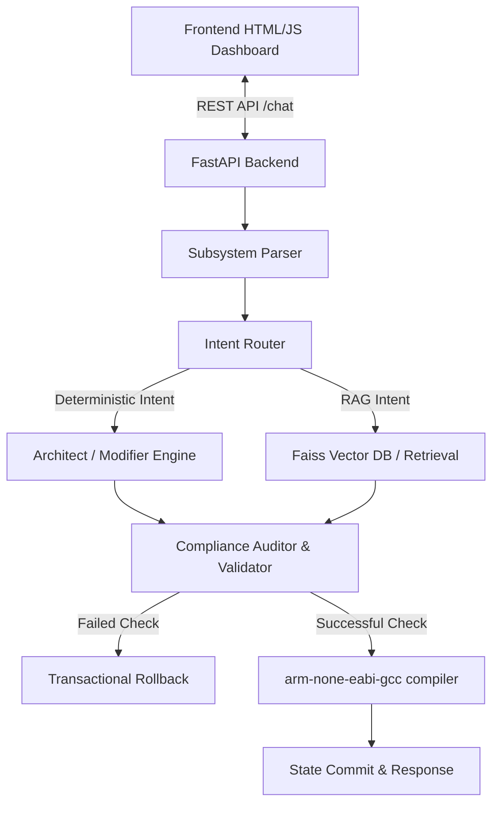

# System Architecture

This document describes the end-to-end design, directory roles, and data flow of the **Deterministic Embedded RTOS Copilot**.

---

## 🏗️ Structural Overview

The copilot consists of a decoupled frontend dashboard and a FastAPI python backend. Communication occurs via a REST API.

---

## 1. Frontend Web Dashboard
Located in `frontend/`, this single-page dashboard provides an interactive engineering interface:
* **Chat Sidebar**: Interfaces with the backend `/chat` endpoint.
* **SVG Topology Graph**: Dynamically parses the current state of tasks, queues, semaphores, and hardware peripherals, rendering them as a visual node diagram.
* **Architecture Snapshot Viewer**: Shows active VIC allocations, PINSEL pin mappings, and queue depths in real-time.
* **Diff Viewer**: Displays C code changes side-by-side using color-coded diff blocks.

---

## 2. FastAPI Backend Services
Located in `backend/app/`, the backend processes queries in 7 distinct pipeline stages to guarantee determinism:
* **`main.py`**: Boots the server, sets CORS rules, and initializes endpoints.
* **`routes/query.py`**: Hosts the `/chat` and `/ask` endpoints, handles compiler syntax checks in temporary paths, and runs atomic rollback operations on failures.

### Core Subsystems (`backend/app/services/`)
1. **`conversation_state.py`**: Maintains in-process architectural state graphs (`ConversationState`) mapped to concrete hardware concepts. Enforces TTL-based lazy eviction.
2. **`parser.py` / `normalizer.py`**: Normalizes shorthand commands and extracts peripheral mentions.
3. **`router.py`**: Classifies query intents. If a query targets a deterministic action (like config modification), it bypasses statistical LLM generators.
4. **`architect.py`**: Generates fresh base configurations matching target parameters.
5. **`modifier.py`**: Core engine that mutates code blocks based on requests. It implements a strict **staged mutation flow** (see `mutation_engine.md`).
6. **`validator.py`**: Rejects invalid hardware/RTOS operations, implementing a two-tier keyword and semantic check.
7. **`rag.py` / `embeddings.py`**: Integrates a local vector storage powered by FAISS to retrieve chip-specific datasheet details or FreeRTOS guidelines.

---

## 3. RAG & Knowledge Retrieval
To avoid LLM hallucinations, retrieval is gated via `FAISS_ENABLED_INTENTS`. 
* Files under `docs/` in the backend (containing hardware specs for LPC2148, standard protocols, and FreeRTOS v8 API guides) are split into chunks.
* Chunks are encoded into embeddings and stored in a FAISS index.
* When a query matches a RAG intent, relevant chunks are fetched and used to populate prompt contexts, guaranteeing that the synthesized explanations remain grounded in target datasheet specifications.
